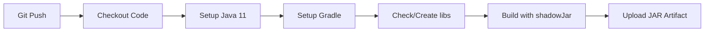

# 🤖 GitHub Actions - Ares Plugin

## ¿Qué hace esta Action?

La GitHub Action **Build Ares Plugin** compila automáticamente tu plugin cada vez que:
- 📤 Haces `git push` a las ramas `main`, `master` o `develop`
- 🔀 Creas un Pull Request
- 🎯 Ejecutas manualmente desde GitHub

## 🚀 ¿Cómo usar?

### 1. **Push automático**
```bash
git add .
git commit -m "feat: nuevo AbilityDisabler"
git push origin main
```
➡️ **Se ejecuta automáticamente** 

### 2. **Ejecución manual**
1. Ve a tu repositorio en GitHub
2. Click en **"Actions"**
3. Select **"Build Ares Plugin"**
4. Click **"Run workflow"**
5. Click **"Run workflow"** (verde)

## 📦 Descargar el JAR compilado

### Después de que termine la compilación:

1. **Ve a Actions** → **Workflow que terminó**
2. **Scroll down** hasta **"Artifacts"**
3. **Download** `Ares-Plugin-XXX.zip`
4. **Extrae** el archivo `Ares-XX.XX.XXXX-all.jar`

### 📁 Estructura del archivo descargado:
```
Ares-Plugin-123.zip
└── Ares-08.01.2025-all.jar  ← Tu plugin compilado
```

## 🛠️ Configuración técnica

### ✅ **Lo que maneja automáticamente:**
- ☕ **Java 11** (Temurin distribution)
- ⚙️ **Gradle 8.10**
- 📚 **Dependencias locales** (crea dummies para compilar)
- 🗂️ **Cache** de dependencias (builds más rápidos)
- 📦 **ShadowJar** (con todas las dependencias incluidas)

### 🔄 **Proceso de build:**


## 🚨 Solución de problemas

### **❌ Build falla?**

1. **Revisa los logs**:
   - Actions → Click en el workflow fallido
   - Click en "build" job
   - Revisa los logs rojos

2. **Problemas comunes**:
   - **Java version**: Se usa Java 11 automáticamente
   - **Dependencies**: Se crean dummy JARs para compilar
   - **Gradle**: Se usa 8.10 específicamente

### **📋 Información del build:**
Cada build muestra:
- 🏗️ Grupo del proyecto
- 📅 Fecha de compilación
- 🎯 Versión de Java
- ⚙️ Versión de Gradle
- 📦 JARs generados

## 🔧 Personalización

### **Cambiar ramas que triggean el build:**
```yaml
# .github/workflows/build.yml
on:
  push:
    branches: [ main, master, develop, tu-rama ]
```

### **Cambiar versión de Java:**
```yaml
- name: ☕ Set up JDK 17
  uses: actions/setup-java@v4
  with:
    java-version: '17'  # Cambia aquí
```

### **Cambiar comando de build:**
```yaml
- name: 🔨 Build with Gradle
  run: |
    ./gradlew clean shadowJar publishToMavenLocal
```

## 💡 Tips

### **✅ Buenas prácticas:**
- 📝 **Commits descriptivos**: `feat: add new ability`, `fix: resolve NPE`
- 🏷️ **Tags para releases**: `git tag v1.0.0 && git push --tags`
- 🔀 **Pull Requests**: Para revisar código antes de mergear

### **⚡ Builds más rápidos:**
- 🗂️ **Cache habilitado**: Dependencias se cachean automáticamente
- 📦 **Artifacts limitados**: Solo se guardan 30 días
- 🎯 **Build específico**: Solo `shadowJar`, no tests innecesarios

## 📞 Soporte

### **Si necesitas ayuda:**
1. 📋 **Revisa logs** en GitHub Actions
2. 🔍 **Check este README**
3. 💬 **Contacta al desarrollador**

---

🎉 **¡Happy Building!** 🚀
